# device_systems API REST

API REST para la gestión de usuarios del sistema device_systems, construida con FastAPI y Python.

---

## Tecnologías utilizadas

- Python 3.13
- FastAPI 0.115.0
- Uvicorn 0.31.0
- Pydantic v2

---

## Instalación

### 1. Clonar el repositorio
```bash
git clone 
cd device_systems
```

### 2. Crear y activar el entorno virtual
```bash
python -m venv venv
source venv/Scripts/activate
```

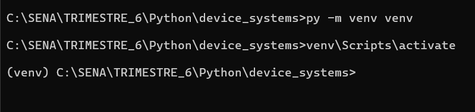

### 3. Instalar dependencias
```bash
pip install -r requirements.txt
pip install email-validator
```

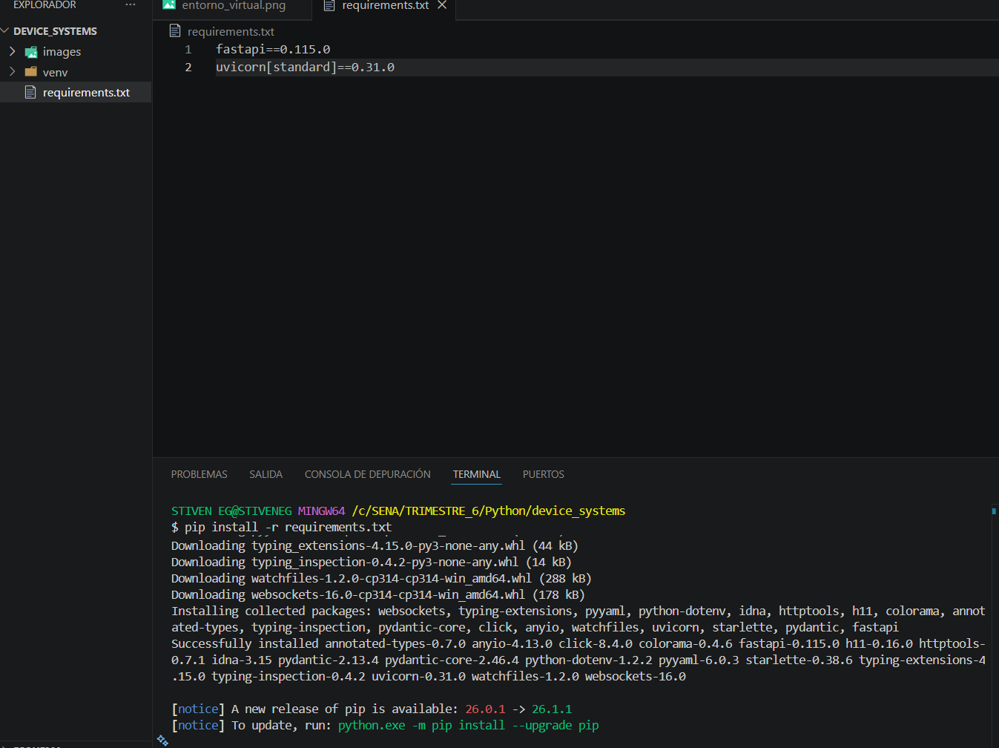

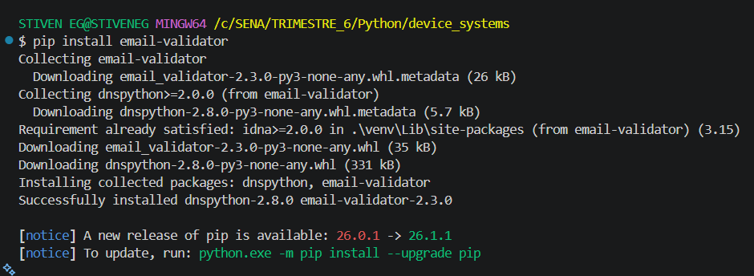

### 4. Ejecutar el servidor
```bash
uvicorn app.main:app --reload
```

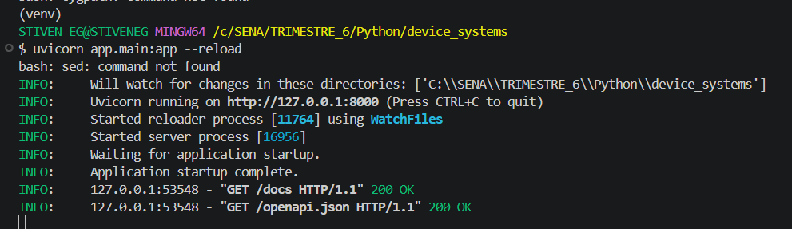

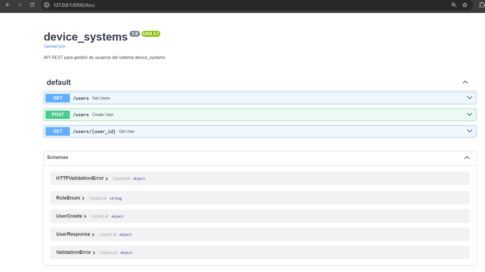

---
```
## Estructura del proyecto
device_systems/
│── app/
│   │── main.py
│   │── schemas/
│   │   └── user_schema.py
│   └── routes/
│       └── user_routes.py
│── images/
│── requirements.txt
└── README.md
```
---

## Modelo de usuario con Pydantic

Los datos del usuario se validan con Pydantic v2. Los campos son:

| Campo | Tipo | Validación |
|---|---|---|
| id | int | Autoincremental |
| name | str | Mínimo 3 caracteres |
| email | EmailStr | Formato válido |
| role | enum | admin, support, user |
| is_active | bool | True o False |


---

## Endpoints

| Método | Ruta | Descripción |
|---|---|---|
| GET | /users | Lista todos los usuarios |
| GET | /users?role=admin | Filtra usuarios por rol |
| GET | /users?is_active=true | Filtra por estado |
| GET | /users/{user_id} | Obtiene un usuario por ID |
| POST | /users | Crea un nuevo usuario |

---

## Swagger UI

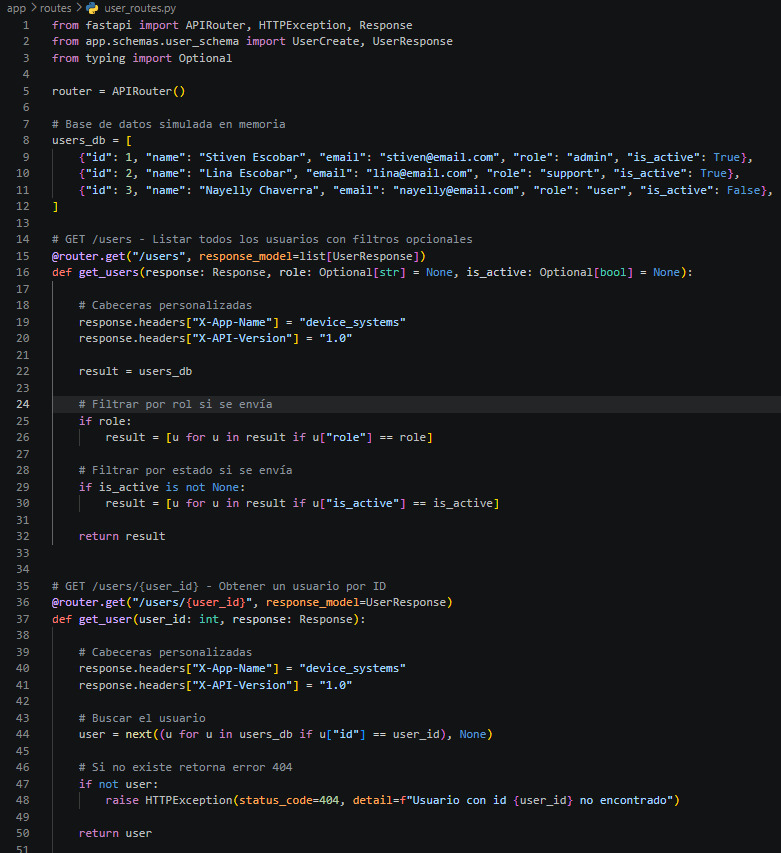

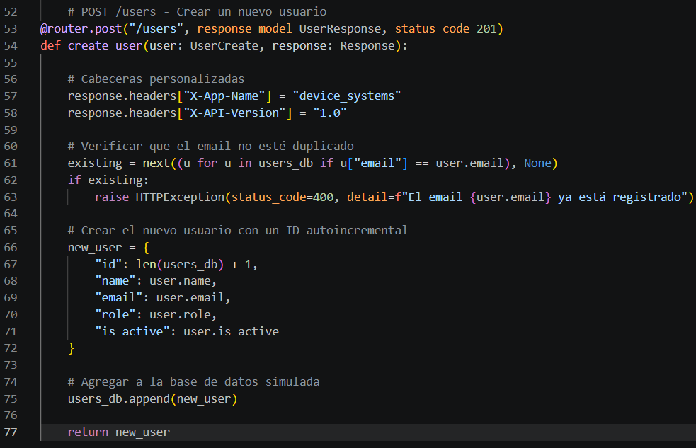

---

## Pruebas GET /users

### Todos los usuarios
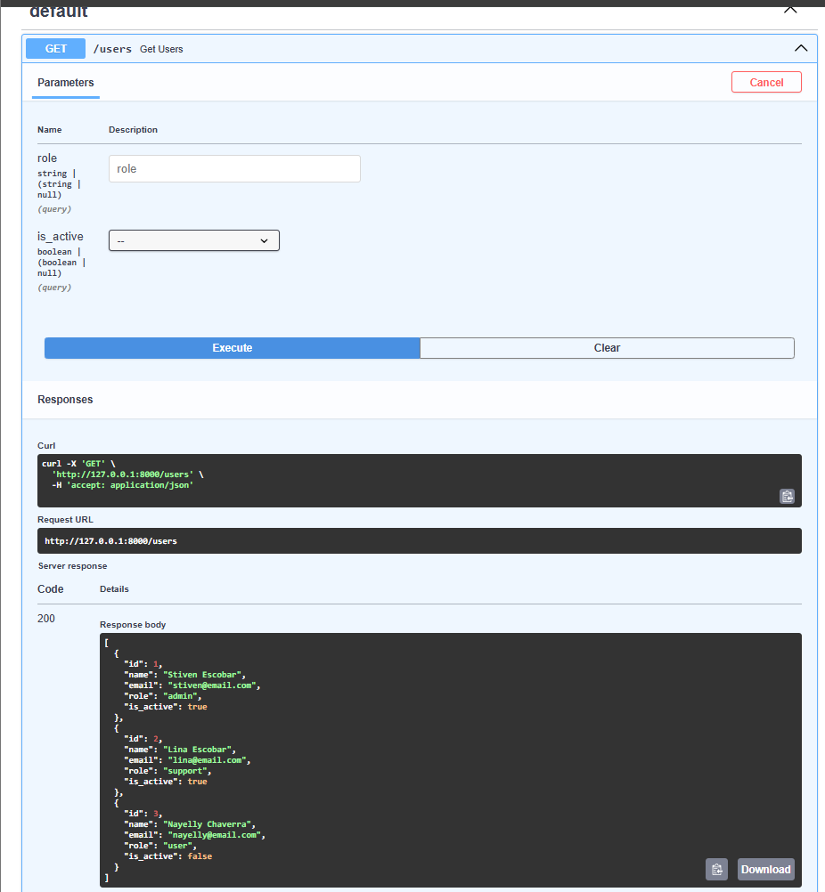

### Filtrar por rol admin
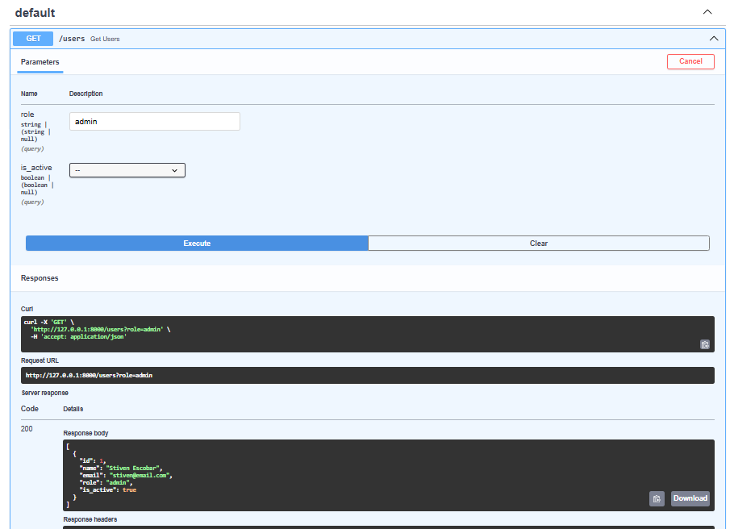

### Filtrar por rol user
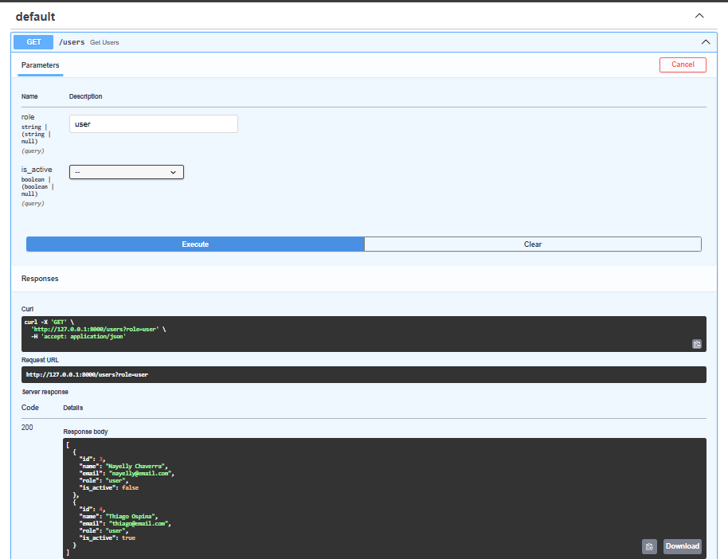

---

## Pruebas GET /users/{user_id}

### Obtener usuario con id 1
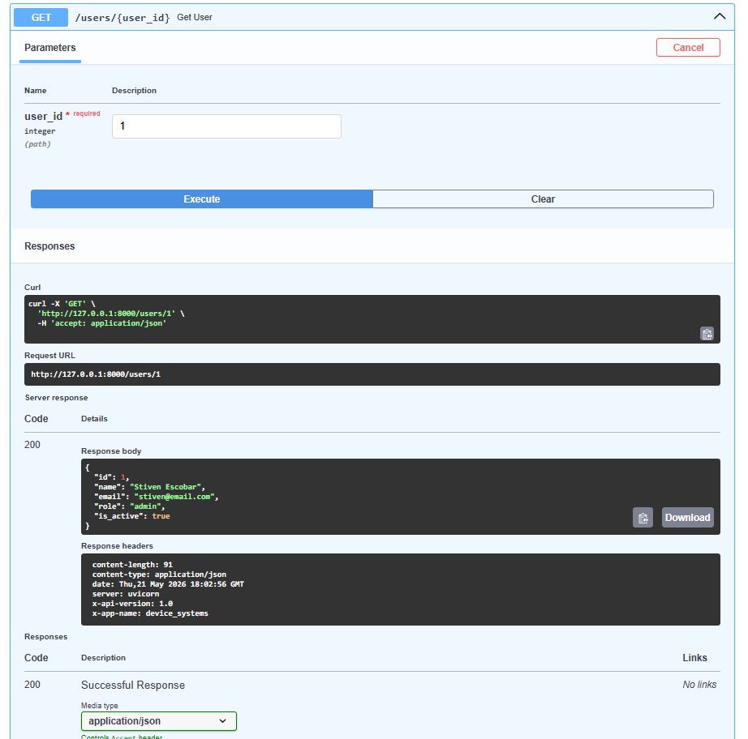

### Error usuario no encontrado id 10
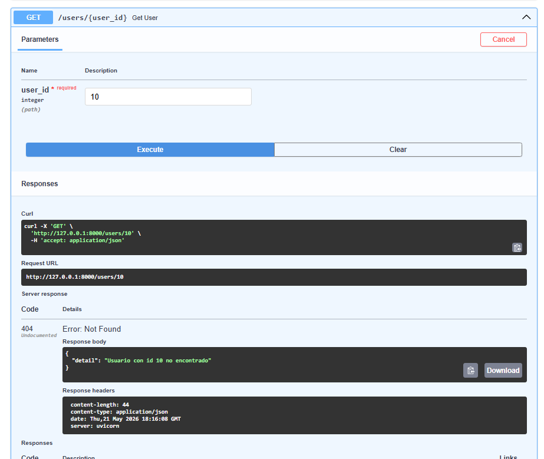

---

## Pruebas POST /users

### Crear nuevo usuario
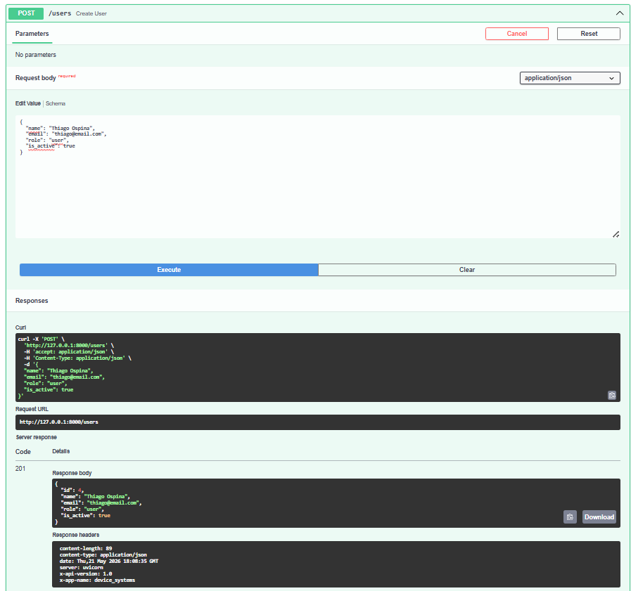

### Error email duplicado
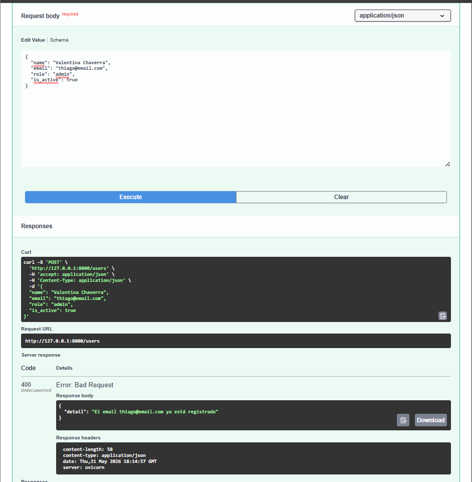

---

## GET /users después de crear el nuevo usuario

Una vez creado el nuevo usuario con POST, al consultar GET /users se puede ver que aparece junto a los demás usuarios del sistema.

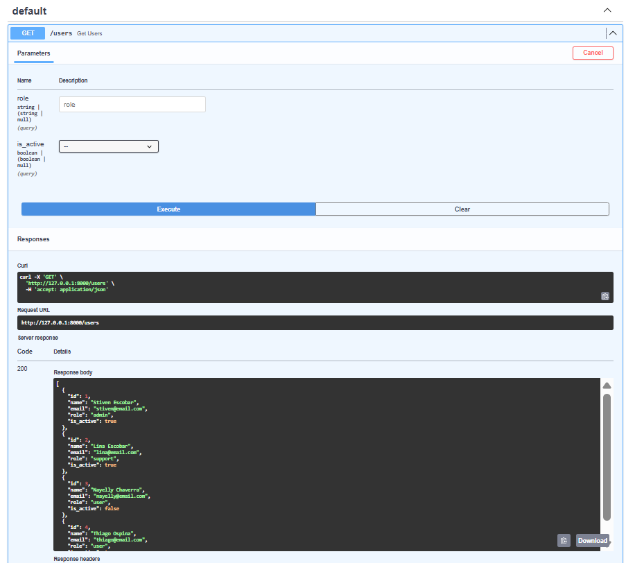

---

## Cabeceras HTTP personalizadas

Cada respuesta incluye las siguientes cabeceras personalizadas:

- `X-App-Name: device_systems`
- `X-API-Version: 1.0`

---

## Reflexión

Trabajar con FastAPI fue una experiencia muy práctica para entender cómo funcionan las APIs REST. Lo más útil fue la integración automática con Pydantic, que permite validar los datos de entrada sin escribir código extra. La documentación automática con Swagger UI facilita mucho las pruebas y la revisión de los endpoints. Además, la forma en que FastAPI maneja los path parameters y query parameters hace que el código sea muy limpio y fácil de entender. Esta actividad me ayudó a comprender cómo se estructura un proyecto backend real con separación de rutas, esquemas y la aplicación principal.

## Video Explicación
[Youtube](https://youtu.be/vKPdV7m22IQ)

## PARTE 2 - Endpoints Completos (CRUD)

En esta segunda parte se completó el CRUD de la API implementando PUT, PATCH y DELETE,
se reestructuró el proyecto en capas, se mejoró el manejo de errores con HTTPException,
se aplicaron códigos de estado HTTP correctos y se implementó Dependency Injection con Depends().

---

## Estructura del proyecto v2.0
```
app/
├── main.py                        → Configuración de FastAPI
├── data/
│   └── users_db.py                → Base de datos simulada en memoria
├── schemas/
│   └── user_schema.py             → Modelos de entrada y salida (Pydantic)
├── routes/
│   └── user_routes.py             → Definición de endpoints
├── services/
│   └── user_service.py            → Lógica de negocio
└── dependencies/
└── user_dependencies.py       → Validaciones reutilizables con Depends()
```

Cada capa tiene una responsabilidad única. Las rutas no tienen lógica, los servicios
no validan datos de entrada, y las dependencias se reutilizan entre endpoints.

---

## Documentación Swagger/OpenAPI

FastAPI genera automáticamente la documentación interactiva con todos los endpoints.


---

## Endpoints de la API

| Método | Endpoint | Descripción | Códigos de estado |
|--------|----------|-------------|-------------------|
| GET | /users | Listar todos los usuarios | 200 OK |
| GET | /users/{id} | Obtener usuario por ID | 200 OK, 404 |
| POST | /users | Crear nuevo usuario | 201 Created, 400, 422 |
| PUT | /users/{id} | Actualizar usuario completamente | 200 OK, 400, 404, 422 |
| PATCH | /users/{id} | Actualizar usuario parcialmente | 200 OK, 400, 404 |
| DELETE | /users/{id} | Eliminar usuario | 200 OK, 404 |

---

## Pruebas GET /users y GET /users/{user_id}

### GET /users — Listar todos los usuarios


---

## Pruebas POST /users — Crear usuario

### POST exitoso (201 Created)


### Error: Campo faltante (422 Unprocessable Entity)


---
### GET /users/{user_id} — Obtener usuario Nuevo

---

## Pruebas PUT /users/{user_id} — Actualización completa

PUT reemplaza **todos** los campos del usuario. Es obligatorio enviar name, email, role e is_active.

### PUT exitoso (200 OK)


### Error: Campo faltante (422 Unprocessable Entity)


### Error: Usuario no encontrado (404 Not Found)


---

## Pruebas PATCH /users/{user_id} — Actualización parcial

PATCH modifica **solo los campos enviados**. Los demás campos no se tocan.
Internamente usa `model_dump(exclude_unset=True)` para detectar qué campos llegaron.

### PATCH exitoso — Actualizar solo el nombre (200 OK)


### Error: PATCH sin datos (400 Bad Request)


---

## Pruebas DELETE /users/{user_id} — Eliminar usuario

### DELETE exitoso (200 OK)


### Error: Usuario inexistente (404 Not Found)


### Verificación: Confirmar que el usuario fue eliminado


---

## Manejo de errores con HTTPException

Todos los errores se manejan con `HTTPException` y retornan respuestas estructuradas:

```json
{
  "detail": "Usuario con ID 999 no encontrado"
}
```

| Error | Código | Causa |
|---|---|---|
| Usuario no encontrado | 404 | ID inexistente en la base de datos |
| Email duplicado | 400 | El email ya está registrado por otro usuario |
| Rol no permitido | 400 | El rol no es admin, support ni user |
| PATCH sin datos | 400 | No se envió ningún campo para actualizar |
| Validación de campos | 422 | Pydantic detectó datos inválidos o faltantes |

---

## Dependency Injection con Depends()

Se implementaron 6 dependencias reutilizables en `user_dependencies.py`:

| Dependencia | Qué hace |
|---|---|
| `get_user_or_404` | Busca usuario por ID, lanza 404 si no existe |
| `validate_unique_email` | Verifica que el email no esté registrado (para POST) |
| `validate_unique_email_for_update` | Igual pero excluye al propio usuario (para PUT/PATCH) |
| `validate_role` | Verifica que el rol sea admin, support o user |
| `get_api_config` | Retorna configuración general de la API |
| `get_current_user` | Simula autenticación básica con token |

Uso en las rutas con `Depends()`:

```python
@router.get("/users/{user_id}")
def get_user(user = Depends(get_user_or_404)):
    return user
```

`Depends()` ejecuta la dependencia antes del endpoint. Si falla, FastAPI detiene
la petición y retorna el error automáticamente, sin llegar al cuerpo del endpoint.

**Ventajas:**
- Validaciones centralizadas y reutilizables entre endpoints
- Código más limpio — las rutas solo coordinan, no validan
- Manejo de errores consistente en toda la API
- Mayor facilidad para hacer pruebas unitarias

---

## Reflexión final — Evolución del proyecto

La versión 1.0 era un prototipo funcional pero limitado, solo GET y POST, y sin manejo de errores estructurado.

La versión 2.0 representa un salto hacia una arquitectura profesional. Separar el proyecto
en rutas, schemas, servicios y dependencias hace que cada parte sea independiente y fácil
de modificar sin afectar el resto. Implementar PUT, PATCH y DELETE completó el CRUD, pero
lo más valioso fue entender la diferencia entre ambos: PUT obliga a enviar todo,
PATCH solo toca lo que llega gracias a `exclude_unset=True`.

El uso de `Depends()` fue el cambio más significativo en términos de arquitectura —
elimina la repetición de validaciones y centraliza el manejo de errores de forma elegante.
Finalmente, Swagger UI sigue siendo una herramienta invaluable: la documentación se genera
sola desde el código, lo que garantiza que siempre esté actualizada.

## === VIDEO EXPLICATIVO ====

[Youtube](https://www.youtube.com/watch?v=A1J01vLPdaA)